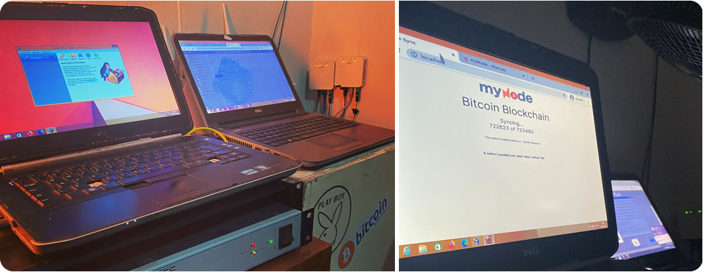
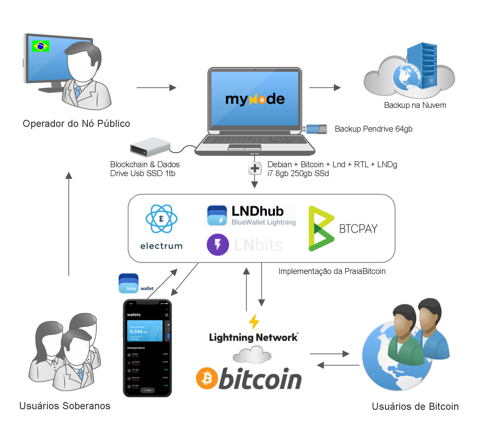
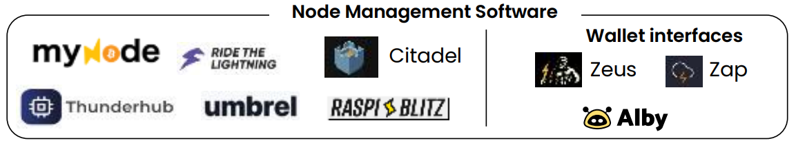
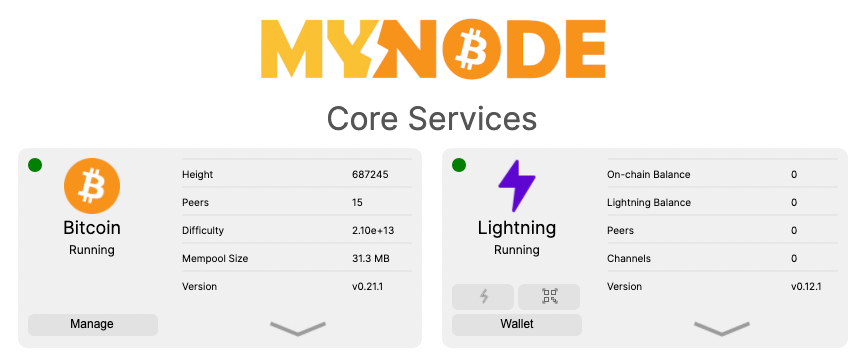
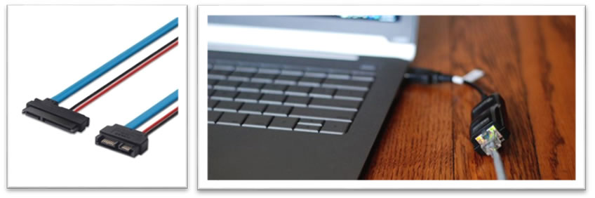

# Banco Padrão Bitcoin no Laptop
Com um Laptop reciclado conectado à internet, iremos rodar um Banco de Bitcoin Experimental com um capital inicial de 0.01 BTC, utilizando o myNodeBTC Premium com Bitcoin Core, Lightning, Electrum e LnBits para permitir que uma pessoa possa iniciar o processo de adoção do padrão bitcoin, utilizando uma infraestrutura simples e confiável.

O serviço pode ser hospedado no conforto da sua casa e é recomendado para famílias, micro-empresas ou pequenas comunidades. 




## Como Funciona
O operador do nó, ou seja, o dono do servidor, gerencia os serviços oferecidos através de uma série de ferramentas de código aberto que estão integradas a rede do Bitcoin e Lightning, instaladas em um laptop com a cópia da blockchain. 

A experiência dos usuários conectados ao nó local utilizando uma carteira lightning através do aplicativo BlueWallet, é como se abrissem uma contra corrente BTC (sem precisarem se identificar), usufruíssem de toda infraestrutura do “Banco Bitcoin” para receber e enviar pagamentos, sem se preocupar com os canais que fornecem a liquidez.

No diagrama abaixo, podemos observar como funciona a implementação Bitcoin e Lighning de baixo custo, a qual você aprenderá a instalar e administrar com ajuda deste guia:




O plugin de contas lightning é controlado pela LNBits usando a extensão LndHub, permite que um grupo de usuários crie contas diferentes com apenas um nó em uma configuração de confiança minimizada. Além disso, utilizamos também o Electrum Server, para garantir uma implementação completa também para carteiras on-chain sem custódia.


# Guia Passo a Passo
Nesta etapa inicial de sua imersão na toca do coelho, o importante é entender o funcionamento das ferramentas e para depois pensar em migrar para o ambiente ideal que couber no seu bolso.  

>IMPORTANTE: Antes de iniciar a instalação, considere ler o **Guia de Segurança Operacional para Operadores de Nós Bitcoin** desenvolvido para aumentar a segurança da sua implementação.
 
> Algumas ferramentas estão apenas em inglês, mas esperamos para que elas estejam acessíveis em Português - Brasileiro futuramente. 
 
## 1.1 - Escolhendo os Equipamentos do Servidor
Qualquer equipamento disponível poderá servir para sua aprendizagem, mas um **laptop com processador i3, i5 ou i7, com no mínimo 8gb de RAM e bateria funcionando**, certamente é a solução mais viável economicamente e que apresentou melhor custo benefício. 

Você tambem pode utilizar um Raspberry Pi 4 ou computador Desktop PC ou Mac, ou a opção mais comoda, o [myNodeOne](https://mynodebtc.com/products/one) que já vem com o software pré-instalado, por $426 dólares +impostos.
  
Além do dispositivo principal, você precisará de:
  - [ ] 1 SSD ou cartão SD Extreme para o Sistema Operacional de no mínimo 32gb.
  - [ ] 1 SSD externo de 1TB para o armazenamento do blockchain.
  - [ ] 1 pendrive para Backup Local
  - [ ] 1 conta no Google Drive para Backup na nuvem
  - [ ] 1 nobreak para proteger seus equipamentos contra surtos elétricos.
  - [ ] 1 conexão com a internet e roteador
 
>Prefira hardwares de marcas confiáveis e de preferência com pouco uso para evitar dores de cabeça. 


 
## 1.2 - O local e a internet
  - [ ] Encontre um local para instalar o Servidor que tenha certa segurança e esteja protegido.
  - [ ] Providencie assim que possível, um nobreak de 1500va pode ajudar em caso de queda de energia, ou uma bateria de carro estacionária com um inversor. 
  - [ ] Solicite uma conexão de cortesia com IP Fixo para o provedor de Internet local ou configure um DNS dinâmico  
  - [ ] Monte os equipamentos de modo que fiquem protegidos e fixados. Colá-los com gotas de cola quente poderá ajudar a prevenir acidentes. 
  - [ ] Utilizar um Rack com chave e ventilação, pode aumentar um pouco a segurança contra roubo e prevenir acidentes. 
  - [ ] Em localidades muito quentes, um ventilador USB ou normal pode ser necessário para resfriar o equipamento, principalmente durante a sincronização da blockchain

>Evite gambiarras o máximo possível.

>Se pensar em tudo isso não é para você, é possível utilizar uma infraestrutura terceirizada, instalando a distribuição do myNodeBtc na [DigitalOcean](https://digitalocean.com) fazendo o upload de uma imagem personalizada do sistema para rodar um droplet com as aplicações na nuvem, custando aproximadamente $80 dolares por mês. 

 
 ## 1.3 - Escolhendo o Software da Distribuição
Existem diversas distribuições similares rodando com a mesma finalidade, sendo possível migrar facilmente a sua carteira lightning para qualquer uma delas e rodar o seu nó onde quiser, mas a base do sistema sempre será a mesma. 

Todas as ferramentas dos clientes Bitcoin & Lighning abaixo, utilizam Debian, Bitcoin Core, Lightning, Specter, Lnbits, BtcPayServer, LndHub, RTL e Electrum. Todos esses softwares são código aberto e estão sob a licença MIT, que significa que basicamente qualquer um pode usá-los, sem qualquer restrição e sem garantias.



>Neste guia iremos utilizar a distribuição MyNodeBtc, devido sua facilidade de uso e suporte premium.  
 

 
## 2 - Configurações do Servidor

### 2.1 - Preparação da Imagem do Sistema Operacional
Durante o período experimental, vamos usar uma imagem pronta para o sistema operacional, gravada diretamente no disco de um laptop reciclado, a fim de oferecer uma maior confiabilidade do hardware e uma instalação mais simples possível

  - [ ] Insira o disco SSD destinado ao sistema operacional em uma gaveta externa USB e conecte-a a estação de trabalho.
  - [ ] Baixe a imagem do Cliente do Bitcoin [Versão MyNodeBTC 2.5.5 amd64](https://mynodebtc.com/device/mynode_images/mynode_amd64_0-2-55_uefi.img.gz)
  - [ ] Instale o Balena Etcher https://www.balena.io/etcher/
  - [ ] Após instalar, rode o programa e selecione a imagem clicando em `Flash from file`
  - [ ] Selecione a imagem baixada `mynode_amd64_0-2-55_uefi.img.gz` e clique em `Ok`
  - [ ] Clique em `Select Target` e selecione o disco de destino. 
  - [ ] Tenha certeza de que selecionou o disco certo, ignore o alerta, clique em `Flash` e aguarde a gravação.
  - [ ] Desligue o computador e remova o disco com segurança.
  
#

### 2.2 - Instalação do Hardware
  - [ ] Abra a parte traseira do Laptop
  - [ ] Instale o SSD que gravou na porta SATA principal.  
  - [ ] Conecte ao laptop o SSD Externo de 1TB com um cabo USB de boa qualidade.
  - [ ] Altere a sequência de boot na BIOS para inicializar pelo SSD com o sistema operacional e aguarde a inicialização.



>DICA: Caso o Laptop possua drive de CD/DVD, remova o drive, compre um cabo adaptador SATA 22 pinos 7+15 para 13 pinos 7+6 F/m, e use a entrada SATA do CD para conectar o drive SSD do sistma operacional e o drive SSD do blockchain na entrada SATA principal.
 
>IMPORTANTE: Evite utilizar conexões wi-fi, apenas em último caso, quando seja impossível fazer de outra maneira ou não tiver acesso ao roteador.
>Caso não possua acesso ao roteador, você poderá rodar o nó com algumas limitações apenas pela rede TOR. 

#

### 2.3 - Iniciando o myNodeBtc
  - [ ] Faça login com o usuário `admin`, senha `bolt` e aguarde o início do navegador. 
  - [ ] No browser que será carregado automaticamente, digite a senha ‘bolt’ para abrir a interface de gerenciamento
  - [ ] Caso o SSD externo de 1tb esteja conectado, o myNode solicitará para formatar o disco.
  - [ ] Após a formatação, vá em settings e altere a senha padrão
  - [ ] Registre a nova senha em seu gestor de senhas ou em local seguro.
  - [ ] Ainda em Settings, desative o Tor para acelerar o processo e aguarde o reinício.

>A sincronização pode demorar alguns dias. Tenha paciência pois as aplicações só serão liberadas após a finalização do processo de sincronização. 

#

### 2.4 - Configuração do Roteador
  - [ ] Descubra como acessar a interface do seu roteador. 
  - [ ] Altere a senha padrão do roteador.
  - [ ] Desabilite a administração remota pela web.
  - [ ] Desative o DMZ se estiver ativado
  	>apenas utilize o DMZ se estiver utilizando dois roteadores, nunca ative o DMZ no roteador conectado direto ao nó
  - [ ] Ative o firewall e a proteção anti-ddos. Não ative a opção  ping-da-morte. 
  - [ ] Se possível atribua um IP LAN Fixo do Servidor linkado ao seu MAC ADDRESS 
  - [ ] Redirecione as portas que serão ativadas 
     	- [ ] Lnd: 9735:9735
    	- [ ] Serviços (MemPol, Explorer, LnBits, BtcPay): 443 -> 49393 (Remap)
    	- [ ] ElectrumServer: 50002:50002 

>Se não estiver usando um IP fixo externo, configure um serviço de DNS dinâmico, se esta opção estiver disponível em seu roteador.

#

### 2.5 - Configurações da Ligthning

#### 2.5.1 - Criação da Carteira
Execute os passos abaixo para criar a carteira Lightning associada ao nó:

  - [ ] Na interface do myNodeBTC, na aba `Lightning`, clique em ` Create Wallet` 
  - [ ] Na página `Lightning Status` clique em `Create Wallet`
  - [ ] Em `Create Lightning Wallet` `Wallet Seed` anote as palavras geradas no seu gerenciador de senhas e guarde uma cópia offline em um pendrive armazenado de forma segunra ou em um cofre.
  - [ ] Em `Re-enter Wallet Seed` insira as palavras da carteira criada e clique em `Create`
  - [ ] Aguarde o carregamento da página `Wallet Created`

##### :tv: Vídeo: [Criando a Carteira da Lightning no myNodeBTC](https://youtu.be/qft4T76Dqtk).

#

#### 2.5.2 - Mudando as configurações da Lightning
Altere as configurações da Lightning para iniciar o serviço
  - [ ] Na interface do myNodeBTC, na aba `Lightning`, clique em `Wallet` 
  - [ ] Na página `Lightning Status` na aba `Lightning`, em `Config`, clique em `view/edit` 
  - [ ] Apague todo conteúdo do arquivo, mas mantenha o endereço do domínio do TOR em `tlsextradomain=` 
  - [ ] Abra este [modelo do lnd.conf](lnd.conf) e copie para área de transferência
  - [ ] Volte ao editor do `lnd.conf` e cole o conteúdo do arquivo
  - [ ] Faça as alterações nos campos 
	- `alias=NOME_DO_SERVIDOR`
	- `tlsextradomain=SEU_DOMINIO_DO_TOR.ONION`
	- `tlsextraip=SEU_IP_EXTERNO`
	- `externalip=SEU_IP_EXTERNO`
   - [ ] Clique em `Save Config`

##### :tv: Vídeo: [Alterando o LND.conf no myNodeBTC](https://youtu.be/wb-2scoZ2PI).

>DICA: Dependendo das configurações e modelo do seu roteador, pode ser que precise fazer outras alterações em seu lnd.conf. Consulte o grupo do NodeRunners Brasil no telegram para obter ajuda. 

# 

### 2.6 - Ativando as outras aplicações do MyNodeBTC

Após fazer login e a sincronização da blockchain for concluida, abra o browser e acesse a na página inicial da interface do MynodeBtc em `http://localhost` e ative as aplicações abaixo clicando em `Enable`:

  - [ ] **RTL**: Interface para administrar a Carteira Lightning associada ao nó
  - [ ] **Electrum Server**: Ele irá sincronizar informações adicionais da blockchain para oferecer os dados para o Explorer e uma conexão dos usuários que configurarem o servidor Electrum da sua implementação. 
  - [ ] **LndHub** Criar carteiras Lightning simples com controle pelo smartphone através da Bluewallet 
  - [ ] **LnBits** Criar carteiras Lightning com funcionalidades  controle por interface web, via API, ou pelo smartphone através da Bluewallet 
  - [ ] **Explorer**: Explorador da blockchain 
  - [ ] **Mempool**: acompanhamento em tempo real do estado da blockchain
 
##### :tv: Vídeo: [Ativando as aplicações do Banco Bitcoin](https://youtu.be/ZTd5tyv9Wf4)
  
#

### 2.7 - Ative o Balance of Satoshis 

- [ ] Em `Applications`, `Manage Apps` encontre o `Balance of Satoshis` e clique em `Install` para ativar o app. 
- [ ] Aguarde a instalação que pode demorar um pouco e a configuração será finalizada mais tarde

#### :tv: Vídeo: [Instalação do Balance of Satoshis](https://youtu.be/buj8dTjJ_Ok) 
  
 #
 
### 2.8 - Ative o LNDg
- [ ] Em `Applications`, `Manage Apps` encontre o `LNDg` e clique em `Install` para ativar o app. 
- [ ] Aguarde a instalação que pode demorar um pouco e a configuração será finalizada mais tarde

#### :tv: Vídeo: [Instalação do LNDg](https://youtu.be/TXImzUFSE_U)

#

### 2.9 - Instale o Google Drive 
  - [ ] Execute os comandos no terminal para fazer download desta versão do gdrive
  https://github.com/prasmussen/gdrive/ 

>DICA: Para colar os comandos no terminal, utilize a combinação das teclas `SHIFT` + `INSERT`

  ```
  sudo su
  cd /home/admin/
  wget https://github.com/prasmussen/gdrive/releases/download/2.1.1/gdrive_2.1.1_linux_amd64.tar.gz 
  tar -xvzf gdrive_2.1.1_linux_amd64.tar.gz
  apt install -y musl
  mv gdrive /usr/local/bin/gdrive
  gdrive about
  ```
  
  - [ ] Copie o código fornecido no terminal em `Go to the following url in your browser` em uma janela do navegador
  - [ ] Faça login na sua conta Google
  - [ ] Clique em `Permitir`

  - [ ] Copie o código de autorização no terminal e pressione enter
```
gdrive mkdir backup
*XBX9GXlR6EmbnY1RLVTk5VUtOVkk created*
```

#### :tv: Vídeo: [Instalação do gdrive](https://youtu.be/TXImzUFSE_U)
#

### 2.10 - Configure o Backup Frequente dos Arquivos Críticos
Arquivos Críticos com backups instantâneos a cada alteração:
channel.backup
lnbits.db
lndhub.db
Postgres: Banco de dados Btcpay

Arquivos do sistema: 
letsencrypt
Ngix
lnd
bitcoin

### 2.11 -  Bot do Telegram
Envia notificações das transações e cópias do channel.backup pelo telegram a cada alteração dos estados dos canais. Este arquivo serve para restaurar seus fundos em caso de desastre.

  - [ ] Abra o link para configurar o Bot do Telegram https://t.me/BotFather 
  - [ ] Siga a execução dos comandos para gerar a chave da API - (Ajuda aqui https://t.me/balanceofsatoshis/53638) 
  - [ ] Envie o comando /newbot
    	- [ ] Defina o nome do app - NOME DO APP
  	- [ ] Defina o username do Bot, no formato: nomedoapp_bot
  	- [ ] Copie a chave da API, que deve se parecer com isto: 
  	`5555555555:AAAAAAAAALRFV1n7QhFu3tzUoq55555555`
  - [ ] No terminal do mynode digite: bos telegram
  - [ ] Insira a chave da API gerada pelo BotFather e pressione enter.
  - [ ] Abra um chat com o seu boot https://t.me/nomedoapp_bot
  - [ ] Na janela do chat digite /connect
  - [ ] Copie o número que será gerado com 9 dígitos
  - [ ] Volte no terminal do mynode e cole o código gerado 
  - [ ] Caso funcione corretamente você verá a mensagem "is_connected: true". 
  - [ ] Aperte CTRL + C para encerrar a aplicação
  - [ ] Configure o início automático do Bot, seguindo as instruções do checklist para o Rapiblitz no link [https://plebnet.wiki/wiki/BoS_Telegram_AutoStart](https://plebnet.wiki/wiki/BoS_Telegram_AutoStart)
	  - [ ] Substitua o `User=bos` por `User=admin`
	  - [ ] Altere o path `/home/bos/.npm-global/bin/bos` por `/usr/bin/bos`
	  - [ ] Salve e reinicie o servidor
	  - [ ] Após a Lightning iniciar, você passará a receber atualizações em tempo real.


## 3 - Publicação dos serviços

### 3.1 - Registre um domínio.
  - [ ] Utilize o GoDaddy ou o Name.com.  
  - [ ] Na compra já ative a Privacidade do Domínio básica. Na name.com utilize o cupom PRIVACYPLEASE para utilizar a privacidade de graça.
  - [ ] Ative a autenticação 2 fatores 
  - [ ] Registrar a senha da conta no gerenciador de senhas. 

>Se optar por não usar um domínio, configure um serviço de DNS dinâmico para seu IP ou utilize o serviço via TOR.

#

### 3.2 - Configurações de DNS
  - [ ] Acesse a [Cloudflare](cloudflare.com), crie uma conta e faça login
  - [ ] Adicione o domínio que registrou a sua conta
  - [ ] Volte no site onde registrou o domínio e aponte para o DNS fornecido pela CloudFlare.
  - [ ] Após alterar o DNS, volte a Cloudflare e clique em verificar
  - [ ]  Deixe o proxy desativado
  - [ ] No menu lateral, em `Rules`, crie uma regra `Forwarding URL`, `301 - Permanent Redirect` para redirecionar de `http://*.seudominio.org/*` para `https://*.seudominio.org/*` 

  - [ ] Em `DNS`, crie entradas TIPO A, para os subdomínios apontando para seu IP:
	- [ ] Explorer:  explorer
	- [ ] Mempool:  mempool
	- [ ] BtcPay: lnbits
	- [ ] Site Padrão: www
  
  - [ ] Desative o proxy no domínio principal que roda o LndHub, Electrum e LnBits. 

#

### 3.3 - Instalação dos Certificados SSL

  - [ ] Abra o terminal e Instale o certbot executando o comando abaixo
	```
	sudo apt-get install certbot
	```

  - [ ] Crie os certificados TLS com o Certbot
	```
	sudo certbot --manual --preferred-challenges dns certonly
	```
	
	```
	Enter email address: emaildoexperimento@protonmail.com
	(A)gree /(C)ancel: A
	(Y)es /(N)o: 
	Please enter your domain name(s): seudominio.org *.seudominio.org
	Are you OK with your IP being Logged: Y
	Please deploy a DNS TXT record under the name _acme-challenge.seudominio.org with the following value: 
	```

  - [ ] Na cloudflare crie uma entrada de DNS TXT com o nome _acme_challenge e insira a chave verificadora no campo TXT. Coloque TTL 1 minuto e aguarde um pouco antes de concluir. Após ter salvo a entrada na cloudflare
  - [ ] Volte ao prompt de comando e pressione enter.
  - [ ] Aguarde os certificados serem concluídos. 
  
  >É muito importante que a instalação do certbot tenha sido realizada para garantir que o certificado SSL seja corretamente configurado. 
  
#


### 3.4 - Publicação dos Serviços 

- [ ] Abra o terminal e rode os comandos abaix, substituindo ***seudominio.org*** pelo domínio registrado ou do DNS dinâmico.
  ```
  sudo su 
  cd /home/admin/
  mkdir scripts
  cd scripts
  git clone https://github.com/PraiaBitcoin/MyNodeBTC-Install 
  cd MyNodeBTC-Install
  chmod 755 install.sh
  ./install.sh --domain seudominio.org 
  ```
  
>EXPLICAÇÂO: Basicamente, o script criado para facilitar a instalação dos serviços do Banco Bitcoin deste guia, adiciona novos os arquivos de configuração dos sites nginx, aponta para seu domínio, configura os certificados adicionando os seguintes arquivos a serem baixados do github. 

    `/etc/nginx/sites-enabled/https_btcpayserver-alt.conf`
    `/etc/nginx/sites-enabled/https_btcrpcexplorer-alt.conf`
    `/etc/nginx/sites-enabled/https_lnbits-alt.conf`
    `/etc/nginx/sites-enabled/https_lndhub-alt.conf`
    `/etc/nginx/sites-enabled/https_mempoolspace-alt.conf`
    `/etc/nginx/sites-enabled/https_www-alt.conf`

    
### 3.5 - Teste os sites da implementação

Para criação das carteiras Lightning com a BlueWallet
- [ ] LnBits: https://lnbits.seudominio.org
- [ ] Server: seudominio.org:50002
- [ ] BtcPay: https://btcpay.seudominio.org 
- [ ] Mempool: https://mempool.seudominio.org  
- [ ] Explorer: https://explorer.seudominio.org
- [ ] Site Padrão do Banco: https://www.seudominio.org  


### 3.6 - Transfira fundos para carteira do Nó

  - [ ] Deposite 0.01 bitcoin para a carteira do nó
  - [ ] Na Interface do myNode ative o RTL
  - [ ] No RTL abra canais com os seguintes nós:
  	- [ ] Praia Bitcoin - Brasil 250000 SATs
  	- [ ] Praia Bitcoin - Jericoacoara  200000 SATs 
  	- [ ] Praia Bitcoin - Natal 200000 SATs
  	- [ ] Lightning.Watch - 10000 SATS
  	
  - [ ] Verifique o nó na 1ml e na Amboss
  - [ ] Compre inbound liquidity na LnBig.com

>Não recomendamos conectar a carteira principal do nó ao seu smartphone


